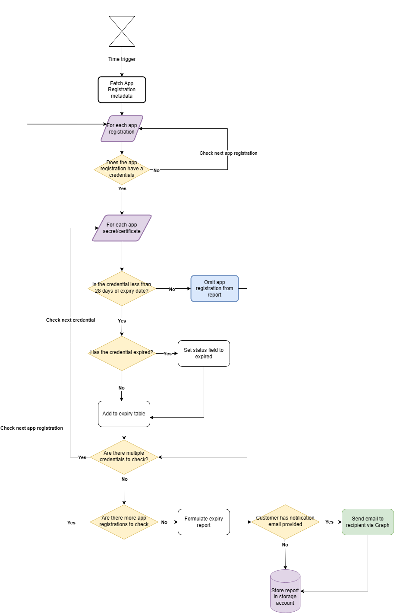
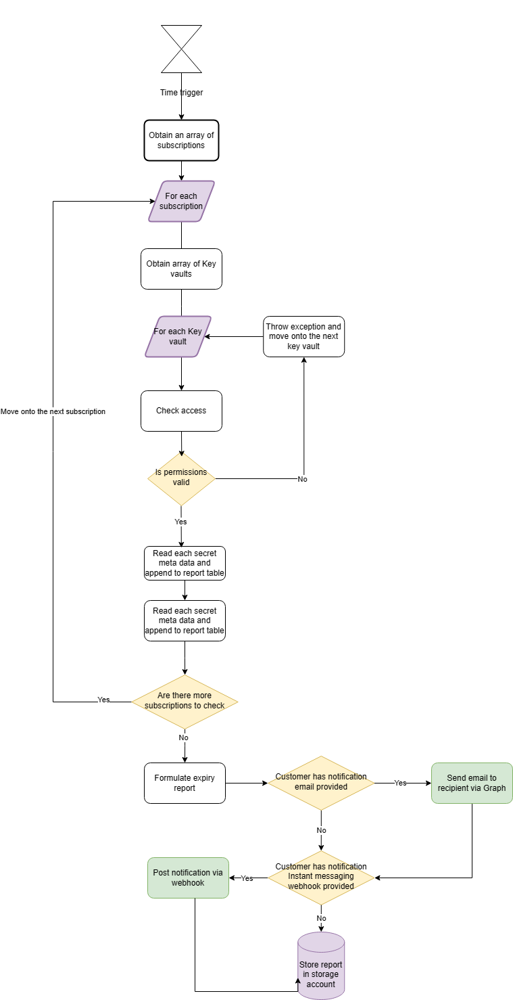
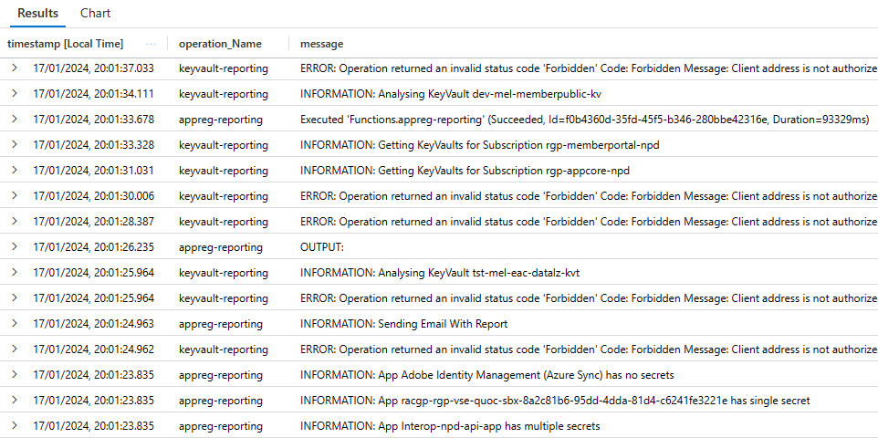

# Secrets Management and Reporting

Using Entra ID app registrations and keyvault secrets and certificates ensures a security posture for any modern cloud organisation.

An abundance of App registrations and Keyvaults are utilised within RACGP. To keep track of secret expiry dates can become a challenge and lead to a risk of downtime to business operations, should they were to expire.

The purpose of this solution is to provide reporting and alert notifications for App registrations and key vault secrets that are due to expire, allowing the administrator to proactively intervene to renew an expiring secret.

# Features

- Scheduled scanning of app registration, keyvault and certificate secrets
- Report generation of secrets that are subject to expiration
- Email notifications to the assigned stakeholders
- Storage of secret reports for future reference

# How it works

The reporting mechanism is driven by an Azure function app which contains two core functions

- Reporting on key vault secrets
- Reporting on Entra ID app registration secrets

The function app is set to execute on a predefined schedule and scans through all required resources. When an expiring secret is detected, the function app will generate a CSV report and store the details in the storage account. Additionally, the function app will send out email notifications to the specified recipients.

The reporting mechanism does not have access to view the actual values of the secrets. Rather, it obtains the metadata of the secret, such as the name and expiry date.

## App registration report content

| Content type      | Description                                                                                      |
| ----------------- | ------------------------------------------------------------------------------------------------ |
| TenantName        | The name of the Entra ID directory which the app registration belongs to                         |
| AppId             | A unique UUID that represents the registration itself                                            |
| AppDisplayName    | A readable name of the app registration                                                          |
| SecretDescription | The name given to the secret of the application                                                  |
| SecretExpiryDate  | The date in which the secret will expire                                                         |
| Status            | The status that determines whether if the secret is `Expired`, `Near Expiry`, `Expired-Renewed`. |

### Status Field

The status field indicates the current state the credental is in

- Expired: Indicates that the secret has expired.
- Near Expiry: Indicates that the secret is getting close to its expiry date.
- Expired-Renewed: In most cases, this means a secret has been renewed. However, there are old secrets that have not been cleaned up and is picked up by the reporting utility.

## Key vault report content

| Content type  | Description                                                                                      |
| ------------- | ------------------------------------------------------------------------------------------------ |
| Subscription  | The subscription which the key vault belongs to                                                  |
| resourceGroup | The resource group which the key vault belongs to                                                |
| KVName        | The name of the key vault which the secret is associated with                                    |
| SecretName    | The name of the secret                                                                           |
| Created       | The date when the secret was generated                                                           |
| Updated       | The date when the secret was last updated/renewed                                                |
| Expires       | The date which the secret will become expired                                                    |
| Enabled       | Determines whether if the secret is enabled for use                                              |
| ContentType   | This is related to certificate only, if the type is a secret, the value will be empty            |
| Tags          | Metadata tags used for referrencing whether if the secret is affiliated with an app registration |

# Report Locations

All reports are stored within the the blob containers in the following storage account <a href="https://portal.azure.com/?feature.msaljs=true#@racgp.org.au/resource/subscriptions/2203f013-1a68-42ec-9c0b-80346b7c1cdf/resourceGroups/shd-secrets-management-rgp/providers/Microsoft.Storage/storageAccounts/shdsecretsmgmtsa/containersList" target="_blank">shdsecretsmgmtsa</a>.

There is a retention period of 30 days for each report before they are purged as configured in the <a href="https://portal.azure.com/?feature.msaljs=true#@racgp.org.au/resource/subscriptions/2203f013-1a68-42ec-9c0b-80346b7c1cdf/resourceGroups/shd-secrets-management-rgp/providers/Microsoft.Storage/storageAccounts/shdsecretsmgmtsa/managementPolicies" target="_blank">Lifecycle management</a> section of the storage account.

# Function App Workflows

## App registration reporting



## Key vault reporting



# Deployment

Deployment of the solution is through Azure DevOps IaC. Refer to the table below for a list of Azure infrastructure resources that make up the solution.

| Resource                | Description                                                            |
| ----------------------- | ---------------------------------------------------------------------- |
| Log Analytics Workspace | Standard as part of Azure deployment for troubleshooting and debugging |
| Application Insights    | Standard as part of Azure deployment for monitoring solution           |
| Function App            | Contains reporting functions                                           |
| Storage account         | For storage of expiry reports                                          |
| App Service Plan        | Compute for running reports                                            |

All resources can be found in the resource group <a href="https://portal.azure.com/#@racgp.org.au/resource/subscriptions/2203f013-1a68-42ec-9c0b-80346b7c1cdf/resourceGroups/shd-secrets-management-rgp/overview" target="_blank">shd-secrets-management-rgp</a>

### Parameters

Parameters can be defined within the [deploy-infra.parameters.bicepparam](bicep/deploy-infra.parameters.bicepparam) file inside the bicep folder of this repo. These parameters define the naming conventions of the resources to be deployed.

# Email mechanism

The email functionality is used to deliver expiry reports to the recipients. It is driven by a module within the following directory in this repo: [function-apps/secrets-management/Modules/EmailModule/EmailModule.psm1](function-apps/secrets-management/Modules/EmailModule/EmailModule.psm1)

This module is executed upon the function code runtime in which calls MS Graph `sendMail` API. The module then converts the .csv reports generated by the secret checker function into a base64 format in order for it to be forwarded.

Keep in mind that the sender email address used for the module requires an mailbox. Distribution groups cannot be used.

### Configuration

The email body/format as well as sender and recipient email addresses are defined as variables in the app configuration of the function app. These are deployed as part of the Infrastructure pipeline deployment in Bicep.

To configure these parameters, adjust the values under object param `appSettings` in the [deploy-infra.parameters.bicepparam](bicep/deploy-infra.parameters.bicepparam) file as required.

| Parameter name                   | Description                                                                                                         |
| -------------------------------- | ------------------------------------------------------------------------------------------------------------------- |
| SM_SCHEDULE_CRON                 | Cron expression to indicate on what schedule the report should be generated. Current setting runs 7am on Monday     |
| SM_CLIENT_NAME                   | Client name to be used in the report                                                                                |
| SM_NEAR_EXPIRY_DAYS              | Number of days to look back for secrets that are about to expire                                                    |
| SM_APP_EXCLUSION_LIST            | Comma separated list of app registrations to exclude from the report                                                |
| SM_NOTIFY_EMAIL_ENABLED          | Enable or disable the email mechanism. Use only `Enabled` or `Disabled` values                                      |
| SM_NOTIFY_EMAIL_FROM_ADDRESS     | The sender email address. This address must from an account in this tenant and will require an mail box to function |
| SM_NOTIFY_EMAIL_TO_ADDRESS       | Comma separated list of recipient email addresses who will receive reports                                          |
| SM_APP_REG_REPORT_MAIL_SUBJECT   | The subject line for the email relating to app registration notifications. Adjust as required                       |
| SM_APP_REG_REPORT_MAIL_MESSAGE   | The body of the email relating to app registration notifications. Adjust as required                                |
| SM_KEY_VAULT_REPORT_MAIL_SUBJECT | The subject line for the email relating to key vault notifications. Adjust as required                              |
| SM_KEY_VAULT_REPORT_MAIL_MESSAGE | The body of the email relating to key vault notifications. Adjust as required                                       |

# Post deployment steps

### Permissions

Once the solution is deployed, the managed identity of the function app will require the following permissions to be granted.

- Grant Entra ID Role `Directory Reader`

- Grant MS Graph API `Mail.Send` permissions

### Network Access to Key Vaults

Key vaults can either be deployed using public endpoint/whitelisting or private endpoints.

When whitelisting is used, the virtual network/subnet which the solution is deployed against must also be white listed against each key vault. In contrast, if private endpoints are used with key vaults, then whitelisting will not be required, as all access will traverse the network and existing peerings.

# Troubleshooting

### Check logs

To check function app runtime logs follow the steps below:

1. Navigate to the secrets management Application Insights instance on the Azure portal at <a href="https://portal.azure.com/#@racgp.org.au/resource/subscriptions/2203f013-1a68-42ec-9c0b-80346b7c1cdf/resourceGroups/shd-secrets-management-rgp/providers/Microsoft.Insights/components/shd-secrets-mgmt-func/logs" target="_blank">link</a>
2. Select the traces table
3. Run the following query

```
traces
| order by timestramp desc
| project timestamp, operation_Name, message`
```

The logs are separated into the following operations

- keyvault-reporting
- appreg-reporting

Example of the logs are shown below



### Troubleshooting permissions

If the function app cannot read te secrets in a key vault, a `Forbidden` error will be returned. These errors will be written to a separate error logs report which is stored in the container `sm-key-vault-error-logs`. The error log is also sent to email recipients.

Details of the logs will include:-

- Subscription name
- Resource group name
- Name of key vault in question
- The asset type (Certificates or Secrets)
- Error message
